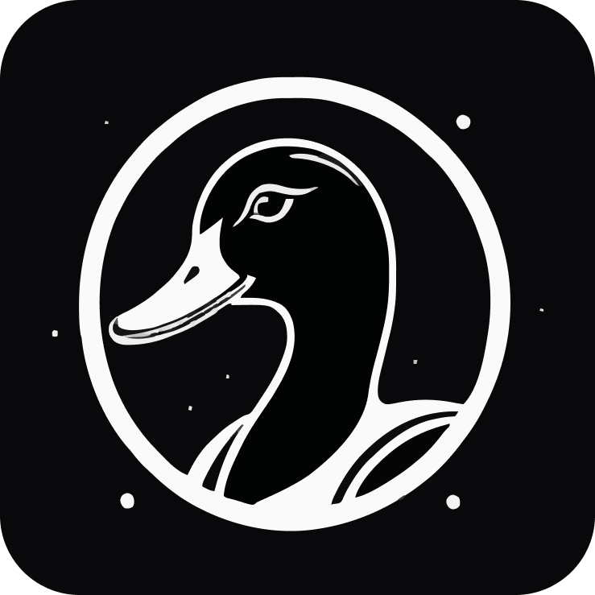

# Duck UI

  

Welcome to **Duck UI**, a modern UI component library designed for flexibility and ease of use. This library provides a set of high-quality React components, styled with a clean and responsive design, perfect for building user interfaces in web applications.

## 🚀 Features

- **Modern Design**: Elegant and customizable components that adhere to modern UI/UX principles.
- **Flexible**: Easily integrate and customize components to fit your design needs.
- **Themed Styling**: Built with a palette that includes black and white, and customizable color options for various themes.
- **Well-documented**: Comprehensive documentation to help you get started and make the most of Duck UI.

## 📄 Contributing

We welcome contributions to Duck UI! To contribute, please follow these guidelines:

1. Fork the repository.
2. Create a new branch for your changes.
3. Make your changes and commit them with clear messages.
4. Open a pull request with a description of your changes.

## 📝 License

Duck UI is licensed under the [MIT License](LICENSE).

## 📧 Contact

For any questions or support, please contact us at [duckui@gentleduck.com](mailto:duckui@gentleduck.com).

---

Thank you for using Duck UI! We hope it helps you build beautiful and functional user interfaces.

Happy coding!

//

<!-- git filter-repo --path node_modules --invert-paths -->
